# Final

## **Team**

Gimel

## **Application**

Tuner

## **Semester**

Fall 2020

## **Overview**

The idea of the *Tuner* application is to provide users with a convenient way to find relevant or related videos on different platforms (primarily YouTube and Spotify). The application will allow users to specify a specific piece of media on one of the listed platforms and receive information and links to relevant media on another differing platform. The available platforms currently include YouTube and Spotify. It will also allow users to store saved playlists of media on the application itself. The goal is to provide a seamless automated process for querying related content between two varying platforms rather than the manual effort of searching and switching between them. *Tuner* is an innovative application that will help simplify the process of searching for the same media on varying platforms. It will help bridge the gap between related content on different platforms. With the ever growing web and the release of new platforms and media sites, *Tuner* can provide an innovative solution as a central hub for finding a specific piece of media on multiple platforms.

## **Team Members**

| Team Member | GitHub Alias |
|-------------|--------------|
| Jason Xiao  | JasonX1250   |
| Alex Lapin  | alleopp      |
| Yaocao Chen | Yaocao       |

## **User Interface**

The following depict the views for the user interface. The files for each view is located in the `client` directory in their respective folders (e.g. `Login` view in the `Login` folder of the `client` directory), except for the `Home` page view and the side menu bar (which are located in the `client` directory).

Every view contains a header where the `☰ Menu` toggle button is located. It also contains the application's name, `Tuner`, which can be clicked to redirect the user back to the Home/landing page of the site. On the right side of the header is the `Login/Logout` button that will allow users to log into or out of their accounts, depending whether they are already logged in.

***Menu***  
Users can navigate to the available platforms (currently only YouTube and Spotify) to start searching for a specific piece of media to convert. The menu side bar will be hidden when collapsed, but will be visible on the left hand side of the application when it is extended into the view. The menu view can be toggled on and off with the `☰ Menu` icon. When a user is logged in, an additional `Saved Playlists` tab will be available, which will redirect the user to another page where they can view their saved playlists.

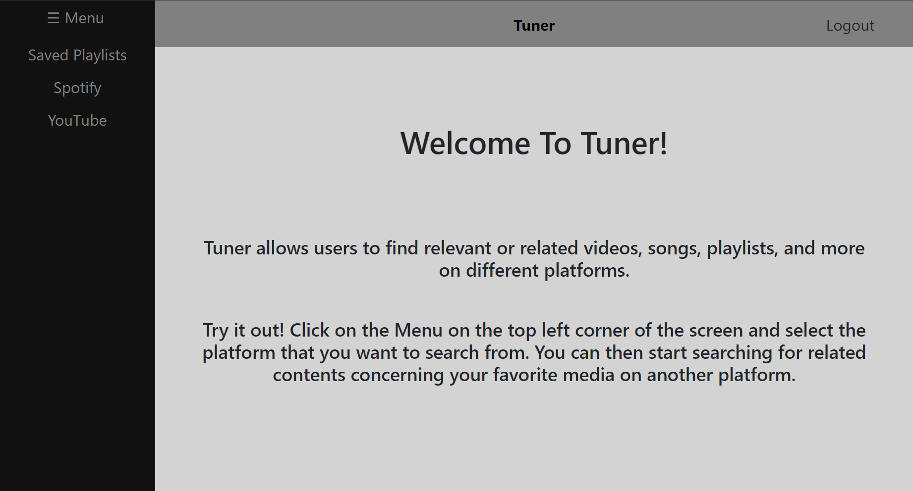

***Home***  
The *Home* view is the landing page of the application, where users will be directed to when navigating to the base url of the site. It contains a welcome message, as well as simple a simple overview and instructions for using the *Tuner* application.

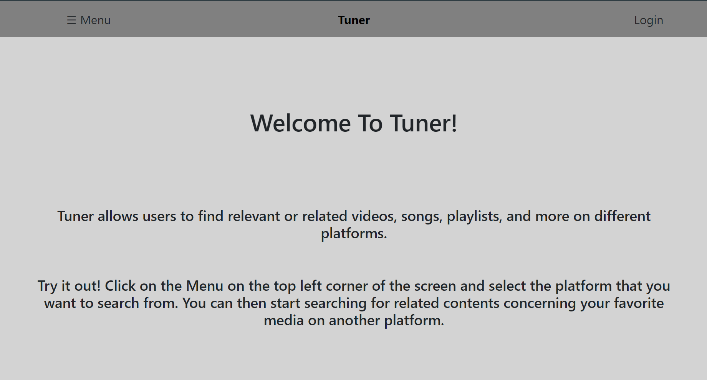

***StartPlatformQuery***  
The *StartPlatformQuery* view allows users to query for media on the starting platform that they intially selected from the *Menu*. Users can choose either to query the media they want to convert via link or via searching by its title. Users also have to set the media type they want to query for (options dependent on the selected platform). After entering the necessary query parameters, users can proceed by clicking the `Search` button. The image below depicts when `Spotify` is selected as the starting platform.

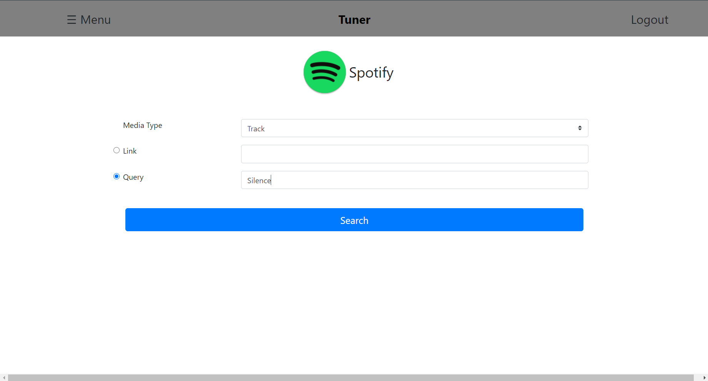

***StartPlatformQueryResults***  
After searching for media to convert from the *StartPlatformQuery* page, users will then be brought to the *StartPlatformQueryResults* view that displays the results of the query. Here, users can view information concerning each result and `Select` one to proceed with converting to another platform. Users can also choose to `Go Back` to the previous *StartPlatformQuery* page.

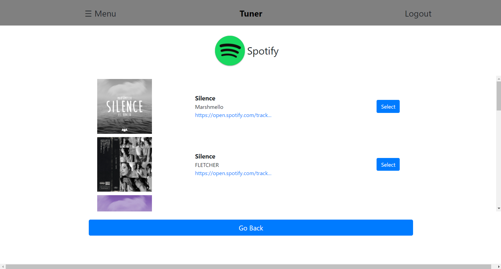

***SelectEndPlatform***  
After selecting a result, from the previous *StartPlatformQueryResults* page, to proceed with, users will then be directed to the *SelectEndPlatform* view. Here, users will select a different platform to convert their selected media to. Users can also choose to `Go Back` to the previous *StartPlatformQueryResults* page.

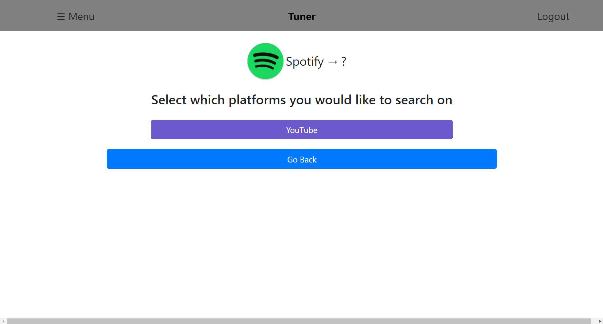

***EndPlatformConvertedResults***  
After having selected an end platform to convert their selected media to, from the previous *SelectEndPlatform* page, users will then be directed to the *EndPlatformConvertedResults* view. Here, users will be presented with results, that are similar or related to their selected media, found on the specified end platform. Information concerning each result will be available for the user to view, including the title, author/creator, and link. Each result can be selected to be added to a new playlist with a specified title or an existing playlist saved under the user's account. To save the selected media to a playlist, the user must be logged into their account. Users can also choose to `Go Back` to the previous *SelectEndPlatform* page.

***SelectPlaylistsToAddTo***  
After having selected at least one piece of media to add to an existing playlist saved under the user's account, users will then be directed to the *SelectPlaylistsToAddTo* view. Here, users will be presented with information pertaining to the playlists saved under their accounts, including playlist's title, length, and the date it was added to the user's account. Users can select playlists to have their converted media added to and proceed by clicking the `Add To Selected Playlists` button. Users can also choose to `Go Back` to the previous *EndPlatformConvertedResults* page.

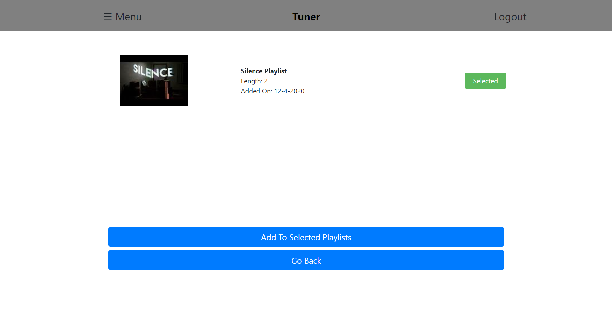

***AddToPlaylistResult***  
After having selected playlists to add the converted media to, from the previous *SelectPlaylistsToAddTo* page, users will then be directed to the *AddToPlaylistResult* view. Here, users can see the status for whether the converted media was successfully added to each playlist. Users can then choose to either search for other media to convert on the same starting platform via the `Convert Other Media` button or to `Go Back` to the previous *SelectPlaylistsToAddTo* page.

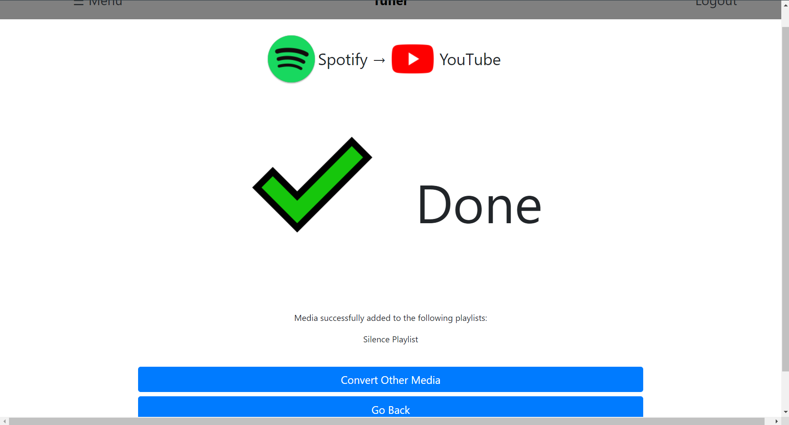

***Login***  
Users can access their account by entering their credentials into the `username` and `password` fields and selecting the `Login` button. Upon successful authentication, users will be redirected to the *Home* page and now have access to additional features, including viewing and modifying saved playlists. Otherwise, an alert will notify the user that the provided credentials are incorrect. Users can also choose to register for an account on the application by selecting the `Register` button.

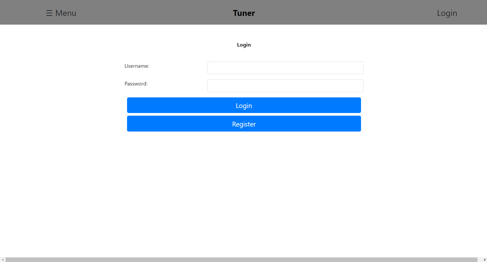

***Register***  
Users can register for an account by entering their proposed *username* and *password* in their respective fields and confirming with the `Register` button. Upon successful registration, an alert will pop up telling the user that their account has successfully been created and the user will be redirected to the *Login* page. Users can also choose to `Go Back` to the previous *Login* page.

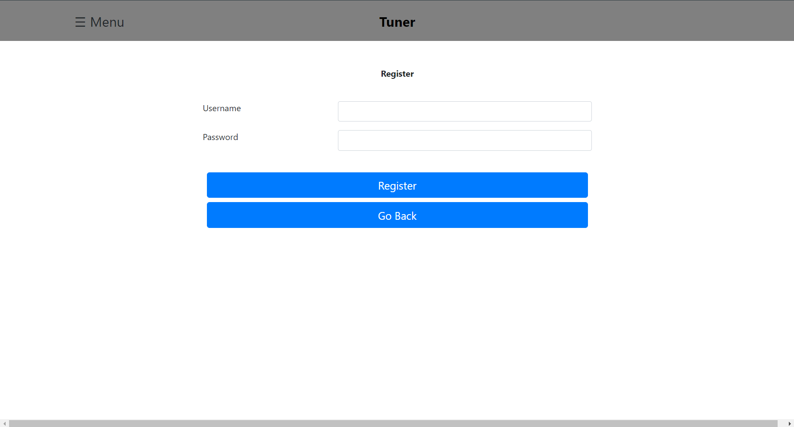

***SavedPlaylists***  
After the user has logged into their account, they can access the *SavedPlaylists* view via the `Saved Playlists` tab in the *Menu*. Here, users can view information pertaining to each playlist saved under their account, including the playlist's title, length, and the date it was added to the user's account. Users can also `Browse` the media contained within a playlist. Users can also choose to `Delete` a saved playlist from their account.

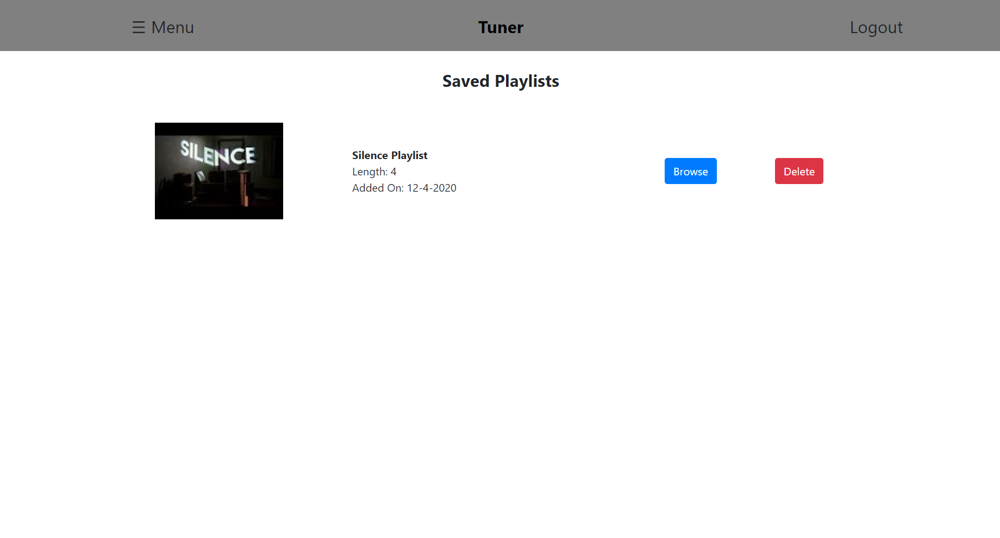

***BrowsePlaylist***  
After selecting to browse the content within a specific playlist, from the previous *SavedPlaylists* page, users can view information concerning each piece of media within the selected playlist. Here, users can view the title, author/creator, and link to each piece of media within the playlist. Users can also choose to `Go Back` to the previous *SavedPlaylists* page.

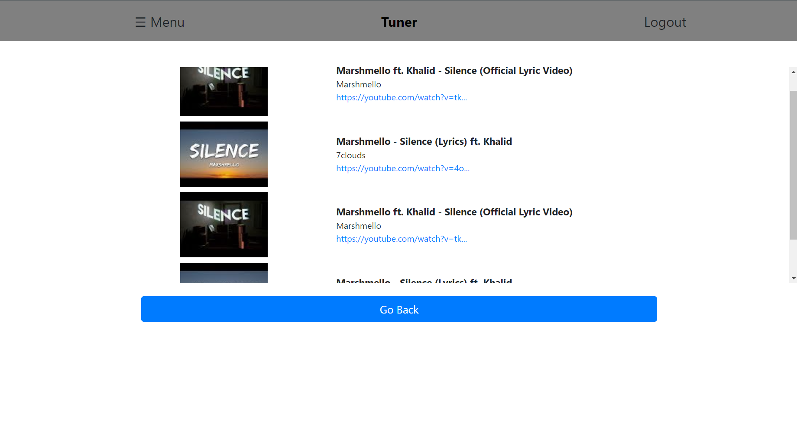

## **API**

The *Tuner* API was implemented using Node.js. The available endpoints and their respective parameters/fields are listed below.

### GET Methods

***queryMedia***  
Returns a list of media from the specified platform matching the given query parameters

| Parameter   | Description                                                            |
|-------------|------------------------------------------------------------------------|
| platform    | Target platform to query media from                                    |
| type        | Type of media to query for                                             |
| queryMethod | Method used to query media [ *link*, *query* ]                         |
| q           | Title of the media to query for (used only when queryMethod = *query*) |
| link        | Link to the media to query for (used only when queryMethod = *link*)   |

> Example: /queryMedia?platform=YouTube&type=Video&queryMethod=query&title=Silence  
  Returns: `[{ title: "Marshmello ft. Khalid - Silence (Official Lyric Video)", author: "Marshmello", link: "https://www.youtube.com/watch?v=tk36ovCMsU8", img: "https://i.ytimg.com/vi/tk36ovCMsU8/default.jpg" }, ... ]`

***getSavedPlaylists***  
Returns a list of saved collections of media under the user's account

| Parameter | Description                 |
|-----------|-----------------------------|
| userId    | Id used to specify the user |

> Example: /getSavedPlaylists?userID=exampleUserId  
  Returns: `[{ id: "5fb9b325c9300125243fab0f", title: "Playlist 1", list: [{title: "Candy Paint", author: "Post Malone", link: "https://open.spotify.com/track/32lItqlMi4LBhb4k0BaSaC", img: "https://i.scdn.co/image/ab67616d0000b273b1c4b76e23414c9f20242268"}, { title: "Candy Paint (feat. Bun B)", author: "Kodak Black", link: "https://open.spotify.com/track/5Su82DCebDzhL88yWyUasx", img: "https://i.scdn.co/image/ab67616d0000b2731541a676423805fc68ff3e66"}], length: 2, img: "https://i.scdn.co/image/ab67616d0000b273b1c4b76e23414c9f20242268", added: "11-21-2020" }, ... ]`

### POST Methods

***convertMedia***  
Returns a list of media found on the target platform matching the given input media

| Parameter     | Type          | Description                                        |
|---------------|---------------|----------------------------------------------------|
| startPlatform | String        | Platform to convert media from                     |
| endPlatform   | String        | Platform to convert media to                       |
| type          | String        | Type of the media to convert                       |
| media         | Array[Object] | List of media to convert to the specified platform |

- **media** object fields
  - *title* - String specifying the title of the media
  - *author* - String specifying the author of the media
  - *link* - String specifying the link to the media on the starting platform
  - *img* - String specifiying the link to the img/thumbnail of the media

> Example: /convertMedia with body: `{ startPlatform: "Spotify", endPlatform: "YouTube", type: "Track", media: {"title":"Silence","author":"Marshmello","link":"https://open.spotify.com/track/7vGuf3Y35N4wmASOKLUVVU","img":"https://i.scdn.co/image/ab67616d0000b273f33ba583059dc2f7d08bf2b8"}`  
  Returns: `[ {"title":"Marshmello ft. Khalid - Silence (Official Lyric Video)","author":"Marshmello","link":"https://youtube.com/watch?v=tk36ovCMsU8","img":"https://i.ytimg.com/vi/tk36ovCMsU8/default.jpg"},{"title":"Marshmello - Silence (Lyrics) ft. Khalid","author":"7clouds","link":"https://youtube.com/watch?v=4oXgCJf4hf8","img":"https://i.ytimg.com/vi/4oXgCJf4hf8/default.jpg"},{"title":"Marshmello - Silence Ft. Khalid (Official Music Video)","author":"Marshmello","link":"https://youtube.com/watch?v=Tx1sqYc3qas","img":"https://i.ytimg.com/vi/Tx1sqYc3qas/default.jpg"}, ... ]`

***newPlaylist***  
Creates a new playlist saved under the user's account on the application and returns the status of whether the media was successfully added to each playlist

| Parameter | Type          | Description                                     |
|-----------|---------------|-------------------------------------------------|
| userId    | String        | Id of the user to save the playlist for         |
| title     | String        | Name of the new playlist to be saved as         |
| playlist  | Array[Object] | Collection of media to save in the new playlist |

- **playlist** object fields
  - *title* - String specifying the title of the media
  - *author* - String specifying the author of the media
  - *link* - String specifying the link to the media on the starting platform
  - *img* - String specifiying the link to the img/thumbnail of the media

> Example: /newPlaylist with body: `{ userId: "5fba22f39d1f5851a05db70c", title: "New Playlist", playlist: [ {"title":"Marshmello ft. Khalid - Silence (Official Lyric Video)","author":"Marshmello","link":"https://youtube.com/watch?v=tk36ovCMsU8","img":"https://i.ytimg.com/vi/tk36ovCMsU8/default.jpg"} ]}`  
  Retuns: `{ success: true }`

***addToPlaylists***  
Adds the chosen pieces of media to specified playlists and returns the status of whether the media was successfully added to each playlist

| Parameter | Type          | Description                                               |
|-----------|---------------|-----------------------------------------------------------|
| userId    | String        | Id of the user who wants to save media to their playlists |
| media     | Array[Object] | Collection of media to add to their existing playlists    |
| playlists | Array[Object] | Collection of user's playlists to add the media to        |

> Example: /addToPlaylists with body: `{ userId: "5fba22f39d1f5851a05db70c", media: [{"title":"Marshmello ft. Khalid - Silence (Official Lyric Video)","author":"Marshmello","link":"https://youtube.com/watch?v=tk36ovCMsU8","img":"https://i.ytimg.com/vi/tk36ovCMsU8/default.jpg"}], playlists: [{"id":"5fc867d5f6a955000483c14c","title":"Playlist 1","list":[{"title":"Marshmello ft. Khalid - Silence (Official Lyric Video)","author":"Marshmello","link":"https://youtube.com/watch?v=tk36ovCMsU8","img":"https://i.ytimg.com/vi/tk36ovCMsU8/default.jpg"}],"length":1,"img":"https://i.ytimg.com/vi/tk36ovCMsU8/default.jpg","added":"12-3-2020"}] }`  
  Returns: `{ success: true }`

***login***  
Returns the status of login given user's credential and a valid userId upon successful authentication

| Parameter | Type   | Description                    |
|-----------|--------|--------------------------------|
| username  | String | username for login credentials |
| password  | String | password for login credentials |

> Example: /login with body: `{ username: user, password: pass}`  
  Returns: `{ success: true, userId: "5fba1bc35bc1152820059b19" }`

***register***  
Returns the status of registering an account for the user with their credentials

| Parameter | Type   | Description                    |
|-----------|--------|--------------------------------|
| username  | String | username for login credentials |
| password  | String | password for login credentials |

> Example: /login with body: `{ username: newUser, password: examplePassword }`  
  Returns: `{ success: true }`

### DELETE Methods

***deleteSavedPlaylist***  
Deletes the specified playlist from the user's collection of saved playlists and returns the status of whether the playlist was succesfully deleted

| Parameter  | Type   | Description                                                              |
|------------|--------|--------------------------------------------------------------------------|
| userId     | String | Id of the user that wants to delete a playlist saved under their account |
| playlistId | String | Id of the playlist to be deleted                                         |

## **Database**

The database was implemented using MongoDB Atlas. The collections and their respective entities/fields are listed below.

### *UserDB.users*

- **_id : ObjectId** - distinct id of a user
- **username : String** - username used for login
- **salt : String** - salt hash used for authenticating login credentials
- **password : String** - password hash used for authenticating login credentials

> *Example*: {  
  ***_id***: ObjectId("5fba22f39d1f5851a05db70c"),  
  ***username***: "user",  
  ***salt***: "61f176b0b0ea106b99388a49638e97ac",  
  ***password***: "4103d794b31b7b8ed46f8efed20a871600d8488bd7cc8f384a2 . . ." }

### *UserDB.playlists*

- **_id : String** - distinct ID of the playlist
- **title : String** - title of the playlist
- **list : Media[]** - array of media within the playlist
  - **title : String** - title of the media
  - **author : String** - author of the media
  - **link : String** - url link to the media
  - **img : String** - url for the thumnail of the media
- **img : String** - url for the thumbnail of the playlist
- **owner : String** - id pertaining to the user that created the playlist
- **added : String** - string representing the date that the playlist was created on

> *Example*: {  
  ***_id***: ObjectId("5fba232e9d1f5851a05db70d"),  
  ***title***: "Playlist 1",  
  ***list***: *Array*,  
    &nbsp;&nbsp;&nbsp;&nbsp;0: *Object*  
    &nbsp;&nbsp;&nbsp;&nbsp;&nbsp;&nbsp;&nbsp;&nbsp;***title***: "Candy Paint",  
    &nbsp;&nbsp;&nbsp;&nbsp;&nbsp;&nbsp;&nbsp;&nbsp;***author***: "Post Malone",  
    &nbsp;&nbsp;&nbsp;&nbsp;&nbsp;&nbsp;&nbsp;&nbsp;***link***: "https://open.spotify.com/track/32lItqlMi4LBhb4k0BaSaC",  
    &nbsp;&nbsp;&nbsp;&nbsp;&nbsp;&nbsp;&nbsp;&nbsp;***img***: "https://i.scdn.co/image/ab67616d0000b273b1c4b76e23414c9f20242268"  
  ***img***: "https://i.scdn.co/image/ab67616d0000b273b1c4b76e23414c9f20242268",  
  ***owner***: "5fba22f39d1f5851a05db70c",  
  ***added***: "11-22-2020" }

## **URL Routes/Mappings**

| Routes                 | View                        | Description                                                      |
|------------------------|-----------------------------|------------------------------------------------------------------|
| /                      | index                       | Home page of the Tuner application                               |
| /startQuery            | StartPlatformQuery          | Page for querying media from starting platform                   |
| /startQueryResults     | StartPlatformQueryResults   | Page for viewing results of queried media from starting platform |
| /selectEndPlatforms    | SelectEndPlatform           | Page for selecting platform to convert media to                  |
| /convertedMedia        | EndPlatformConvertedResults | Page for viewing converted media on the designated platform and selecting the ones to add to playlists                                                                                    |
| /addToPlaylists        | SelectPlaylistsToAddTo      | Page for viewing user's saved playlists to add the selected media to (requires authentication)                                                                                                 |
| /addToPlaylistsResults | AddToPlaylistResult         | Page for viewing which playlists had the specified successfully added to it (requires authentication)                                                                                     |
| /login                 | Login                       | Page for user to login to the application                        |
| /register              | Register                    | Page for user to register an account for the application         |
| /savedPlaylists        | SavedPlaylists              | Page for user the playlists saved under their account (requires authentication)                                                                                                           |
| /browsePlaylist        | BrowsePlaylist              | Page for viewing the media within a playlist (requires authentication)                                                                                                           |

## **Authentication/Authorization**

Users can register and login via the respective pages on the web application. Upon registering an account, the user's credentials will be saved to the database. Specifically, their username, a salt hash, and a password hash (formed by both the user's password and the salt) will be saved along with a unique id for their account. Users can then attempt to login with their credentials, which will be sent to the server and checked with *`minicrypt`*. The server will fetch the associated salt and password hashes for the given username and confirm that the provided password from the user matches the salt and password hashes with *`minicrypt`*. Upon successful authentication, the server will respond with a object with the `success` field set to true and a `userId` set to the valid id associated with their account. Otherwise, it will respond with an object with the `success` field set to false.

With proper authentication/authorization, users should now be able to see the ***Saved Playlists*** tab in the menu, granting them access to the playlists saved under their account. From the `SavedPlaylists` view, users can view information concerning their saved playlists and delete any of these collections. Users should also now be able to add any converted media to an existing playlist saved under their account (bringing them to the `SelectPlaylistsToAddTo` and eventually `AddToPlaylistResult` views) or create a new playlist to save with any selected, converted media and a specified title.

## **Division of Labor**

### Jason Xiao

- Frontend
  - Implemented user interface views
    - Home
    - Menu
    - StartPlatformQuery
    - SelectEndPlatformQuery
    - EndPlatformConvertedResults
    - SelectePlaylistsToAddTo
    - AddToPlaylistResult
    - SavedPlaylists
    - BrowsePlaylist
- Backend
  - Implemented API endpoints and their respective helper functions
    - queryMedia
    - getSavedPlaylists
    - convertMedia
    - newPlaylist
    - addToPlaylists
    - login
    - register
    - deleteSavedPlaylist
  - Database
    - Helped set up the data models for the ***users*** and ***playlists*** collections in MongoDB Atlas
    - Hooked up database calls to backend endpoints
  - Set up Heroku deployment
- Documentation
  - ideas
  - milestone 1
  - milestone 2
  - milestone 3
  - setup
  - final

### Alex Lapin

- Frontend
  - Implemented user interface views
    - Login
    - Register
- Backend
  - Implemented API endpoints
    - login/google
    - login/google/return
  - Database
    - Initial set up of the ***UsersDB*** database, the ***users*** and ***playlists*** collections, and data models on MongoDB Atlas
    - Created credentials for database users
  - Restructured src code for server routing for clarity (routes.js and index.js)
  - Authorized application for usage of YouTube's Data API

### Yaocao Chen

- Backend
  - Authorized application for usage of Spotify's Web API
- Frontend
   -Implemented user interface views
    - Login
    - Register
- Documentation
  - setup
  - milestone 1
   
 

## **Conclusion**

Throughout the project, we were able to learn more about the process of building a new application from the ground up, including techniques for implementing the UI for the frontend, the API endpoints and routing for the backend, setting up the database and data models, configuring authorization/authentication, and deploying it to production on Heroku. We were able to gain a better understanding of the amount of work required for implementing all of the systems and features that make an application such as *Tuner* fully functioning and operational.

However, the journey was not without difficulties and obstacles as many problems arose when we first started working with external API's including YouTube's Data API and Spotify's Web API. One of the large hurdles we had to overcome at first involved getting authentication/authorization access for the *Tuner* application on both of the API's. We also ran into further trouble with issues getting user login functioning for both their YouTube and Spotify accounts and verifying the permissions and scopes that the *Tuner* application had over these accounts. As a result, a more simpler approach was taken without the use of login for either YouTube or Spotify. Other technical difficulties included working with a limited quota for YouTube's Data API, which prevents excessive calls to their API's endpoints. This reduced the progress of testing some of the backend endpoints as there was a cap to the number of calls we could make to their API per day.

Overall, the team was able to gain a lot of experience working together to build a real-world, innovative application that could be widely used one day. We were able to apply the knowledge we learned from class (*CS 326: Web Programming*) and  improve our own skills as developers while building a working application. This was a fun project to work on and we hope you enjoy the functionality of the *Tuner* application!
