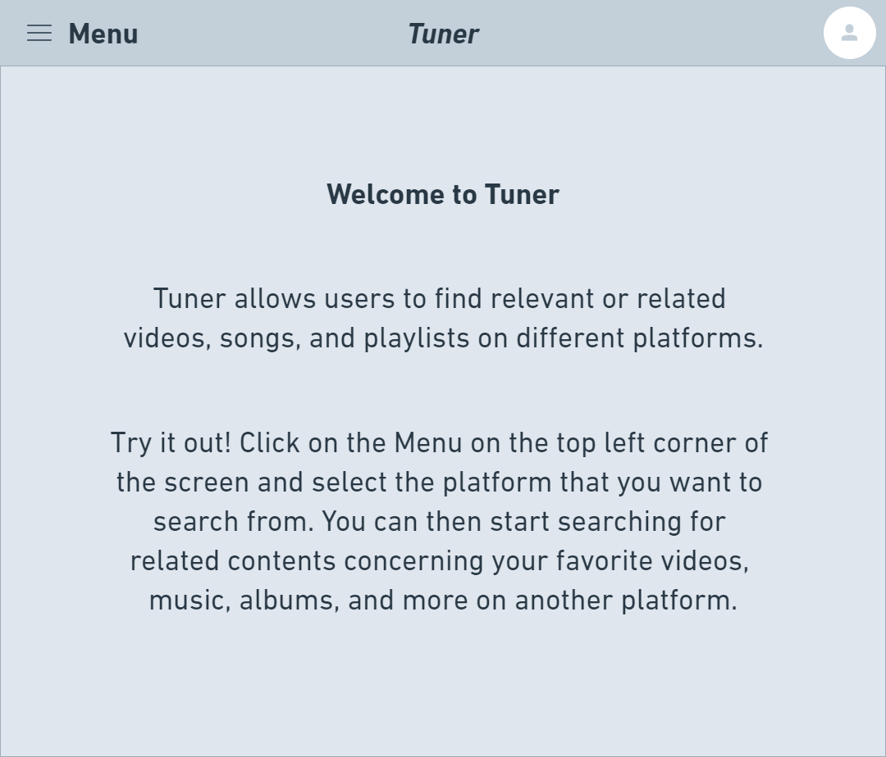
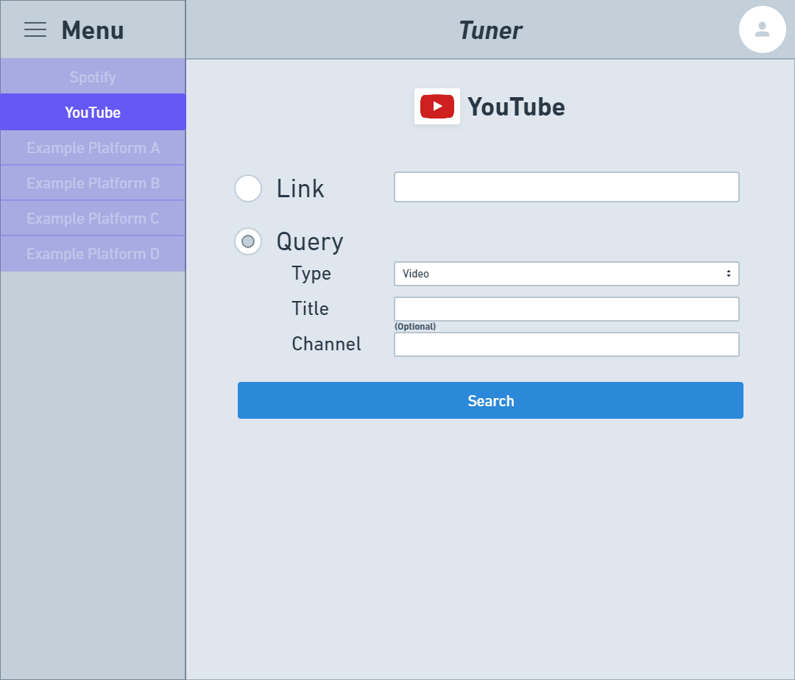
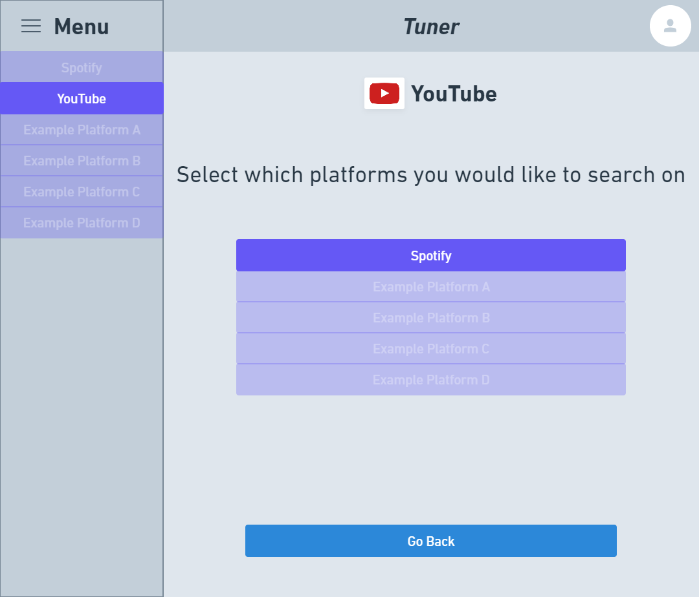
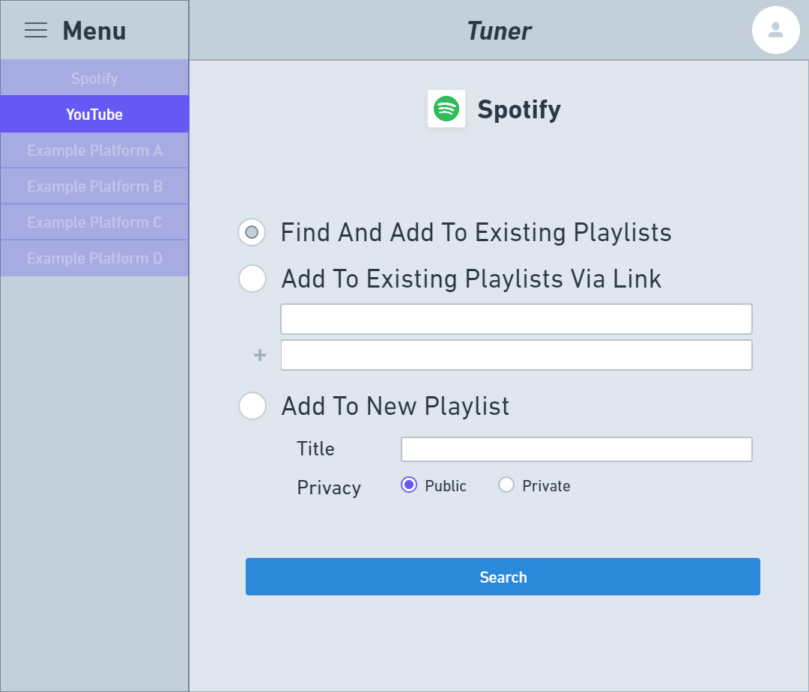
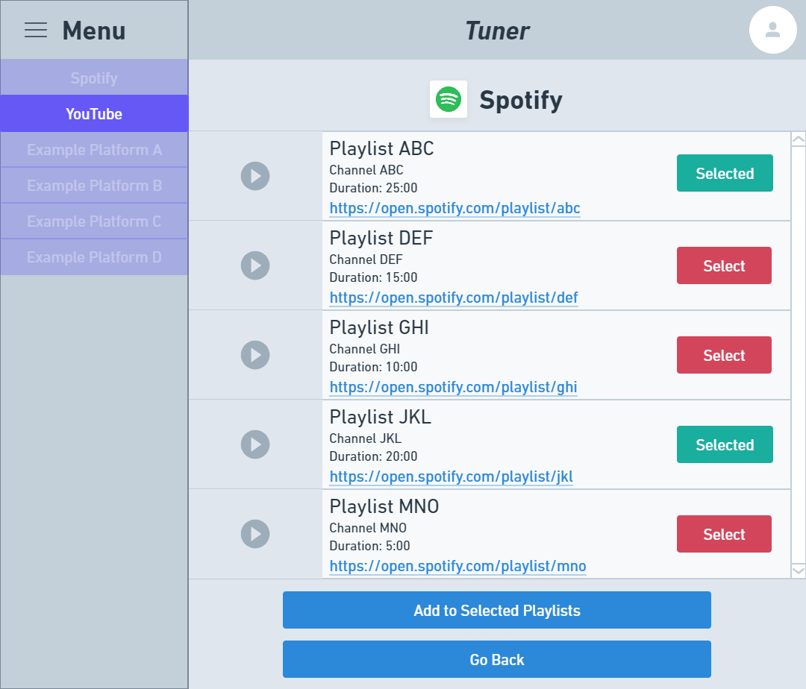
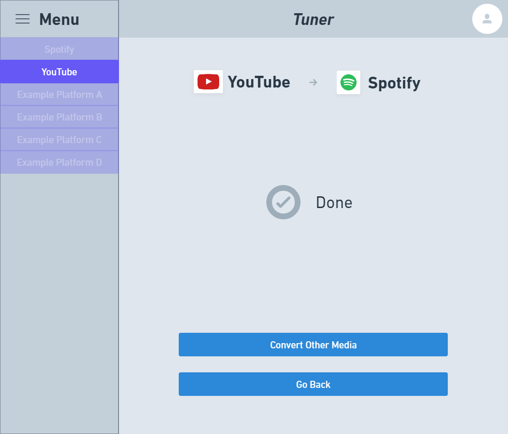

# Milestone 1

## Data Interactions

### Overview

Users can . . .

- Login to their YouTube and Spotify accounts
- Select the platform, that contains the media they want to query, from the Menu
- Enter info related to the media to query
- Select the specific piece of media to proceed with
- Select the platform that they want to query from that relates or is relevant to their selected piece of media
- Review information concerning the search results
- Select from the search results the pieces of media they would like to add to playlists
- Select the playlists or enter information about the playlists that they want to add the selected media to
- Go back to any previous step during any part of the process

### In-Depth Descriptions

Users will be presented with the Home page upon arriving at the site. They can come back to this page by clicking on the ***Tuner*** title at the top of the page. They can select various platforms to query from via the Menu, located in the top left corner. They can also login to any of the platforms via the Profile icon in the top right corner.

After selecting a platform to get their video, song, playlist, album, etc. from, users can enter information concerning the the piece of media they want to use for the query.

The application will return a list of possible matches for the media the user want to use. They can select one from the list to proceed.

The user then has to select which platform(s) they would like to find media pertaining to their selected piece on.

The application will return a list of media that has relevant or related data to their original selected piece of media. Here, users can review information pertaining to each piece of media returned by the search results, with a link to each piece on the intended platform. Users can also select which ones they would like to add to playlists or restart the process to convert other pieces of media.

- For converting single pieces of media (like a video on YouTube), the query results will list multiple pieces of media (like songs on Spotify) that all have some relevant or related data pertaining to the user's original selected piece of media to search for.
- For converting multiple pieces of media (like a playlist of videos on YouTube), the query results will return a list of media pieces, with each piece having some relevance to one corresponding piece supplied by the user's original media to query for. For example, if the user wanted to query Spotify media using a YouTube playlist with videos *A*, *B*, and *C*, then the search results would return a list of songs *X*, *Y*, and *Z* (where song *X* pertains to video *A*, *Y* to *B*, and *Z* to *C*).

After having selecting piece of media to add to playlists, users have to specify which playlist(s) to add the pieces to. They can do this via (1) looking up existing playlists under their account and selecting them, (2) specifying the link(s) to playlists under their account, or (3) creating a new playlist for their account with the selected pieces.

This is an example of finding existing playlists under the user's account and selecting the ones to add their new pieces of media to.

Afterwards, the application will notify the user whether the selected pieces of media have been successfully added to the intended playlist(s). Users can then choose to repeat the process with other media or platforms.

## Division of Labor

### Jason

- Milestone 1 writeup
- Wireframes mockups

### Yaocao
-implement Wireframes 2

### Alex
