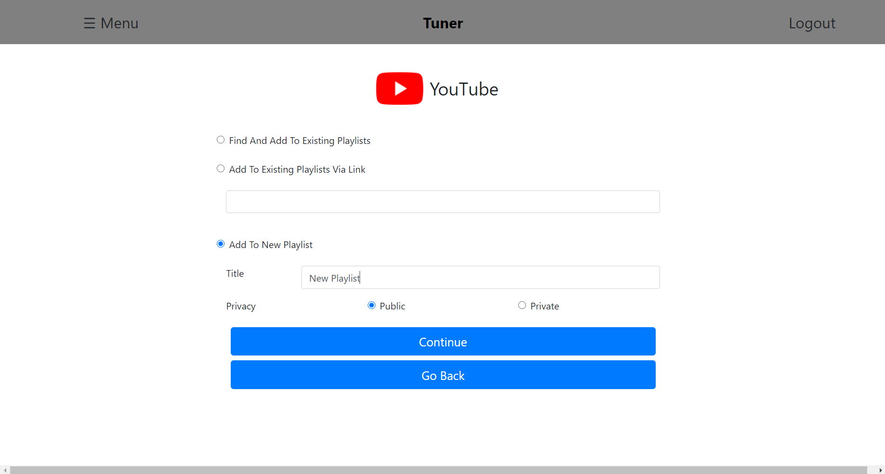
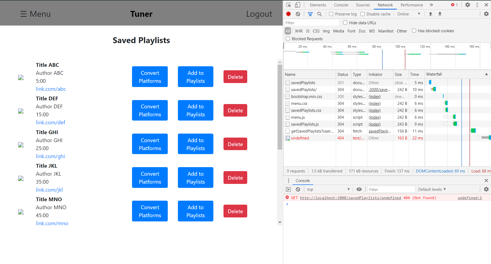
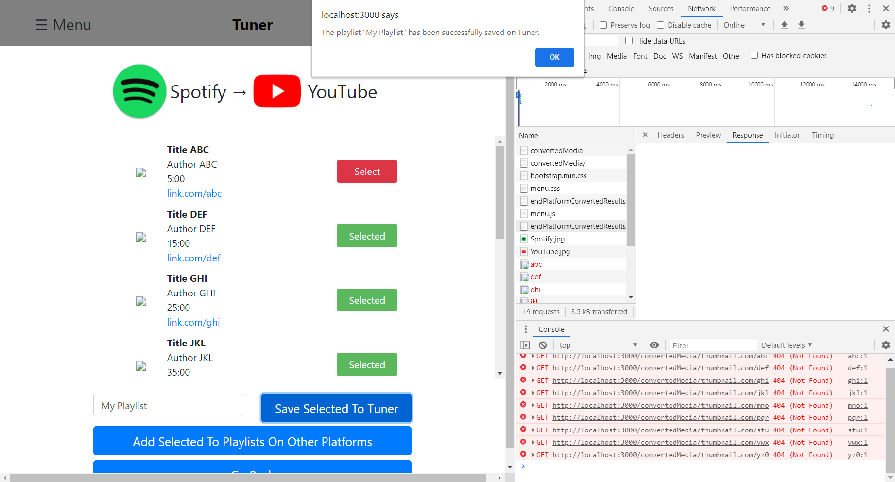
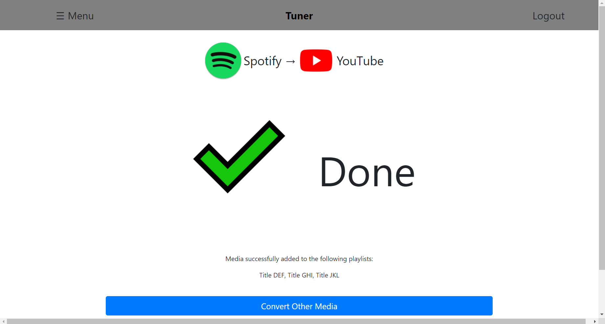

# Milestone 2

## Deployment

The tuner app can be found at <https://tuner-app.herokuapp.com/>

## API Overview

### GET Requests

> ***queryMedia***  
Returns a list of media from the specified platform matching the given query parameters

| Parameter | Description |
|-----------|-------------|
| platform | Target platform to query media from |
| queryMethod | Method used to query media [ *link*, *query* ] |
| query | Parameters used to query media based on queryMethod |

- **query** fields when **queryMethod** = *link*

  - *link* - String specifying link to media on specified platform

- **query** fields when **queryMethod** = *query*

  - *title* - String specifying the title of media to query for
  - *type* - String specifying type of media to query for
  - *author* (optional) - String specifying author of media to query for

Example: /queryMedia?platform=YouTube&queryMethod=query&title=exampleTitle&type=video

> ***queryPlaylists***  
Returns a list of playlists from the specified platform matching the given query parameters

| Parameter | Description |
|-----------|-------------|
| platform | Target platform to query for playlists on |
| queryMethod | Method used to query for playlists [ *find*, *link* ] |
| query | Parameters used to query playlists based on queryMethod |

- **query** can be left empty when **queryMethod** = *find*
- **query** fields when **queryMethod** = *link*
  - *link* (String) - Link to playlist on specified platform

Example: /queryPlaylists?platform=Spotify&queryMethod=link&link=exampleLink

> ***getSavedPlaylists***  
Returns a list of saved collections of media under the user's account

| Parameter | Description |
|-----------|-------------|
| userId | Id used to specify the user |

Exampe: /getSavedPlaylists?userID=exampleID

### POST Requests

> ***convertMedia***  
Returns a list of media found on the target platform matching the given input media

| Parameter | Type | Description |
|-----------|------|-------------|
| platform | String | Target platform to convert media to |
| media | Array[Object] | List of media to convert to the specified platform |

- **media** object fields
  - *title* - String specifying the title of the media
  - *author* - String specifying the author of the media
  - *duration* - String specifying the duration of the media

> ***newPlaylist***  
Creates a new playlist on the specified platform and returns the link associated with it

| Parameter | Type | Description |
|-----------|------|-------------|
| userId | String | Id used to specify the user |
| auth | String | Authetication for verifying the user |
| platform | String | Target platform to create the new playlist on |
| details | Object | Parameters used for creating the new playlist |

- **details** fields
  - *title* - String specifying the title of the playlist to query for
  - *private* - Boolean specifying whether the new playlist will be private ( *true* ) or public ( *false* )

> ***addToPlaylists***  
Adds the specified media to the target playlists and returns a list of Strings (*success* or *failure*) indicating the status of adding media to each playlist

| Parameter | Type | Description |
|-----------|------|-------------|
| userId | String | Id used to specify the user |
| auth | String | Authentication for verifying the user |
| platform | String | Platform that the playlists are on |
| media | Array[String] | List of links to media to be added to playlists |
| playlists | Array[String] | List of links to playlists to add the media to |

> ***savePlaylist***  
Saves the collection of converted media to user's account and returns a string representing the Id of the saved playlist (-1 if failed to saved playlist)

| Parameter | Type | Description |
|-----------|------|-------------|
| userId | String | Id used to specify the user |
| auth | String | Authetication for verifying the user |
| title | String | Name for the collection of media to save |
| media | Array[Object] | List of media to be saved as a collection under the user's account |

- **media** object fields
  - *title* - String specifying the title of the media
  - *author* - String specifying the author of the media
  - *duration* - String specifying the duration of the media
  - *link* - String specifying the link for the media

> ***login***  
Autheticate the user with the given credentials and returns a userId and accessToken for the account upon success.

| Parameter | Type | Description |
|-----------|------|-------------|
| username | String | Username for the account |
| password | String | Password for the account |

### DELETE Requests

> ***deleteSavedPlaylist***  
Deletes the specified playlist from the user's collection of saved playlists

| Parameter | Type | Description |
|-----------|------|-------------|
| userId | String | Id used to specify the user |
| auth | String | Authetication for verifying the user |
| playlistId | String | Id of the playlist to delete |

## Examples of CRUD Operations

In this image, a POST request will be made to create a new playlist to add media to. The user will specify the title and privacy of the new playlist and a request will be sent to the `/newPlaylist` endpoint upon clicking *Continue*.

In this image, a GET request was made to retrieve the user's playlists saved under their account. They have access to the info of each playlist and the options to (1) convert the media in the selected playlist to another platform, (2) add the media in the selected playlist to another playlist on the same platform, or (3) delete the saved playlist from their account. The deletion will require making a DELETE request to the server, while the other two options will redirect the user to the proper page.

In this image, a POST request was made to the `/convertMedia` endpoint. The response is then displayed onto the webpage, allowing users to choose which media pieces they would like to add to playlist(s). Here, we can also see that the user can also save it to their account with a specified title; this can be done with a POST request from the client to the `/savePlaylist` endpoint.

This image shows the result of POST request to the `/addToPlaylists` endpoint. It displays the status of adding the selected media to the specified playlists and reports back which playlists the media have been successfully added to.

## Division of Labor

### Jason

- API Overview
- Backend Skeleton Code
  - server/index.js
- Configured Routing and added API calls to server from client
  - StartPlatformQuery  &#8594;  /startQuery
  - StartPlatformQueryResults  &#8594;  /startQueryResults
  - SelectEndPlatform  &#8594;  /selectEndPlatform
  - EndPlatformConvertedResults  &#8594;  /convertedMedia
  - SpecifyPlaylistsToAddTo  &#8594;  /playlistQuery
  - SelectPlaylistToAddTo  &#8594;  /addToPlaylists
  - AddToPlaylistResult  &#8594;  /addToPlaylistsResults
  - Login  &#8594;  /login
  - SavedPlaylists  &#8594;  /savedPlaylists
- Heroku Deployment
- Setup (on local machine) Doc
- CRUD Screenshots and Descriptions

### Yaocao

- Get the authorization from Spotify web api

### Alex
